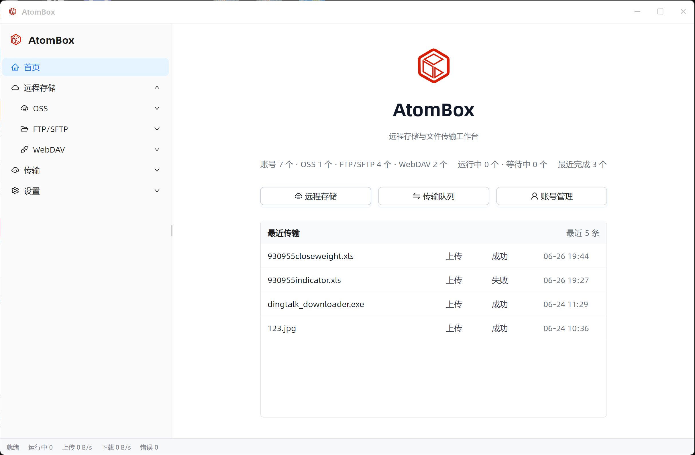
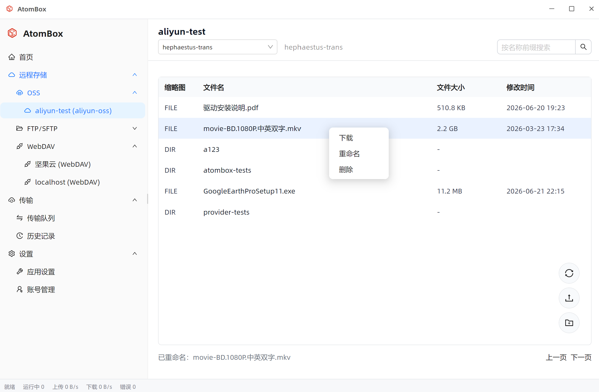
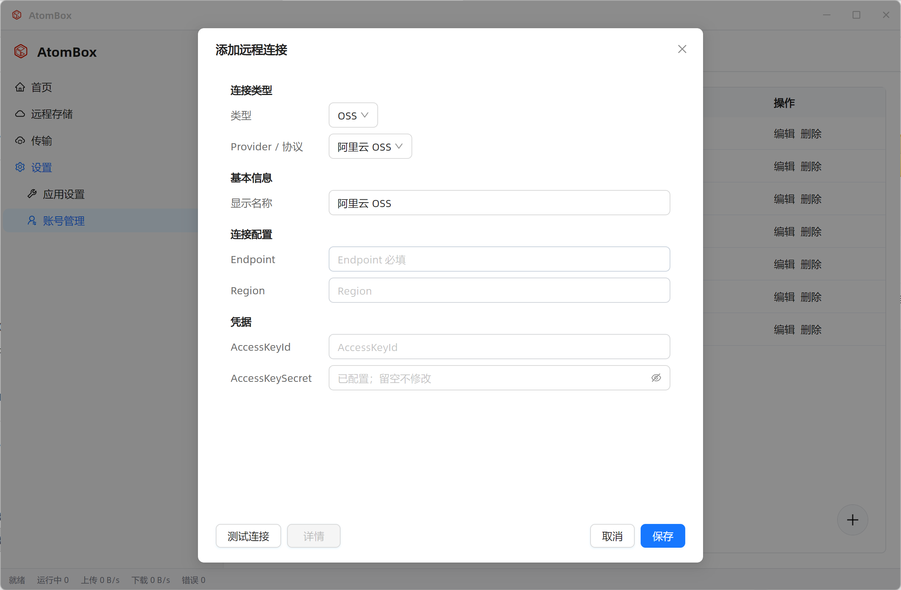
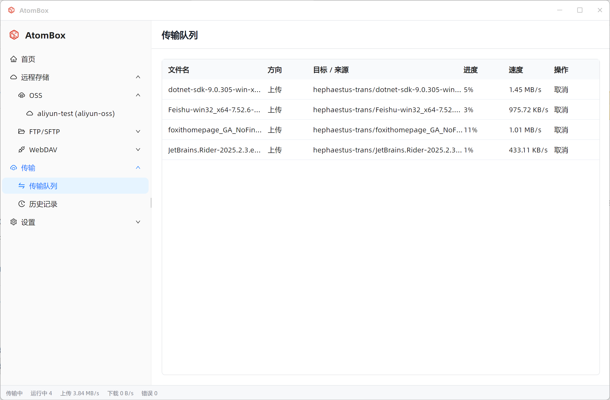

# AtomBox

[](https://github.com/ChengLab/AtomUI)


AtomBox 是一个远程存储与文件传输桌面工具。

它基于 AtomUI 构建桌面界面，把 OSS、FTP/SFTP、WebDAV 等远程存储统一到一个界面里，方便你添加账号、浏览远程文件、上传下载文件，并查看传输队列与历史记录。



## 功能概览

AtomBox 的主要功能按左侧菜单组织：

```text
AtomBox
├─ 首页
├─ 远程存储
│  ├─ OSS
│  ├─ FTP/SFTP
│  └─ WebDAV
├─ 传输
│  ├─ 传输队列
│  └─ 历史记录
└─ 设置
   ├─ 应用设置
   └─ 账号管理
```

## 首页

首页用于快速查看 AtomBox 当前状态。

你可以在这里看到：

- 已添加的账号数量。
- OSS、FTP/SFTP、WebDAV 等不同类型账号的数量。
- 当前运行中、等待中和最近完成的传输任务数量。
- 最近传输记录。
- 快速进入远程存储、传输队列和账号管理。

## 远程存储

远程存储是 AtomBox 的主要工作区域。

当前支持：

- OSS 对象存储。
- FTP/SFTP 文件服务。
- WebDAV 文件服务。

在远程存储页面中，你可以：

- 浏览 bucket 或远程目录。
- 打开文件夹。
- 使用路径导航返回上级目录。
- 在 OSS 中按名称前缀搜索文件。
- 上传文件。
- 新建文件夹。
- 刷新当前目录。
- 对文件进行下载、重命名、删除等操作。
- 对文件夹进行打开、重命名、删除等操作；部分 Provider 会根据服务能力限制某些操作。



### OSS

OSS 账号用于连接对象存储服务。

当前已接入或支持的对象存储包括：

- 阿里云 OSS
- 腾讯云 COS
- 七牛云 Kodo
- 又拍云 USS
- 华为云 OBS
- 火山引擎 TOS

其中阿里云 OSS、腾讯云 COS、七牛云 Kodo、又拍云 USS、华为云 OBS、火山引擎 TOS 是当前版本的主要使用路径。

OSS 页面支持 bucket 选择、文件列表浏览、前缀搜索、上传、下载、重命名和删除。

### FTP/SFTP

FTP/SFTP 适合连接传统文件服务器或 Linux 服务器目录。

SFTP 支持：

- 服务器地址和端口。
- 用户名。
- 密码认证。
- SSH 私钥认证。
- Home 目录。

FTP 支持：

- 服务器地址和端口。
- 匿名访问。
- 用户名/密码认证。

### WebDAV

WebDAV 适合连接支持 WebDAV 协议的网盘或文件服务。

WebDAV 支持：

- 通用 WebDAV。
- 坚果云 WebDAV。
- 匿名访问。
- 用户名/密码认证。

## 账号管理

账号管理用于新增、编辑和删除远程连接。

添加账号时，可以选择连接类型和具体 Provider，然后填写连接信息与凭据。保存前可以先点击“测试连接”，确认配置是否可用。



账号管理支持：

- 新增远程连接。
- 编辑已有连接。
- 删除已有连接。
- 测试连接。
- 根据连接类型展示不同配置项。

## 传输

传输模块用于查看上传、下载任务。

### 传输队列

传输队列展示当前正在执行或等待执行的任务。

你可以看到：

- 文件名。
- 上传或下载方向。
- 目标或来源路径。
- 当前进度。
- 当前速度。
- 任务操作，例如取消。



当前传输队列支持：

- 多个文件同时上传或下载。
- 按应用设置中的最大并发数执行任务。
- 显示实时传输速度。
- 取消运行中的任务。
- 对失败任务重新执行。

### 历史记录

历史记录用于查看已经完成、失败或中断的传输任务。

你可以用它确认某个文件是否已经上传或下载完成，也可以查看失败任务并重新处理。

## 应用设置

应用设置用于调整 AtomBox 的基础行为。

当前可配置：

- 启动后默认打开的页面。
- 关闭窗口时是退出应用还是最小化到托盘。
- 默认下载目录。
- 最大并发传输数量。
- 保留已完成传输记录。
- 打开配置目录、日志目录和状态目录。

## 当前版本说明

当前版本重点覆盖远程存储浏览和基础文件传输。

已覆盖的主路径：

- 添加远程账号。
- 测试连接。
- 浏览远程目录或 bucket。
- 上传文件。
- 下载文件。
- 重命名文件或文件夹。
- 删除文件或文件夹。
- 查看传输队列。
- 查看传输历史。

新版本TODO：

- FTPS。
- 京东云、青云、百度智能云OSS接入。
- 断点续传恢复。
- 跨 Provider 同步。
- 文件夹递归上传/下载。
- 文件预览和缩略图。
